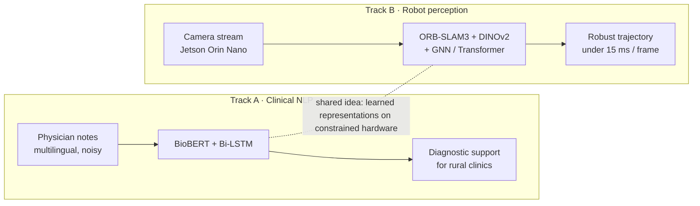

<div align="center">


<sub><code>README.md</code> &nbsp;·&nbsp; <code>cs.CL</code> <code>cs.CV</code> <code>cs.RO</code> &nbsp;·&nbsp; rev. October 2026</sub>

**Harshavarthan S**<sup>1</sup><br/>
<sub><sup>1</sup> Department of Computer Science & Engineering, SSN College of Engineering, Chennai, India</sub>

<a href="https://git.io/typing-svg"></a>

<a href="https://in.linkedin.com/in/harshavarthan-s"></a>
<a href="mailto:harshavarthansami@gmail.com"></a>
<a href="https://doi.org/10.1201/9781003777458-12"></a>
<!-- Add your Scholar profile: replace YOUR_ID and uncomment
<a href="https://scholar.google.com/citations?user=YOUR_ID"></a>
-->

</div>

---

> **Abstract.** I work on two problems that look unrelated and aren't. The first is clinical: rural hospitals in Tamil Nadu often have a general practitioner and no specialist, so I build decision-support models (BioBERT + Bi-LSTM, multilingual) that read physician notes and flag conditions like neonatal sepsis, marasmus and tuberculosis before they are missed. The second is robotic: keeping a SLAM system on a Jetson Orin Nano on track when the world gets messy, by bringing self-supervised features (DINOv2) and graph/transformer matching into ORB-SLAM3. Both reduce to one question — *how do you make a model trustworthy on cheap hardware, in places where nobody is around to fix it?*
>
> **Keywords —** clinical NLP · decision support · multimodal retrieval · visual SLAM · edge AI

<br/>



<p align="center"><sub><b>Fig. 1.</b> Two research tracks, one underlying question.</sub></p>

---

### § 1 &nbsp; Ongoing work

<table>
<tr>
<td width="50%" valign="top">

**Neural-SLAM-Zero** &nbsp;<sub>`Jan 2026 – present`</sub>

Self-supervised visual SLAM for edge robots, funded by an **IFPS Institutional Research Grant** at SSN.

```yaml
goal:     ">40% lower ATE vs. ORB-SLAM3 baseline"
budget:   "<15 ms per frame"
hardware: Jetson Orin Nano
stack:    [ORB-SLAM3, DINOv2, GNN, Transformers, PyTorch, OpenCV]
```

</td>
<td width="50%" valign="top">

**Centre for Digital Infrastructure, NIT Trichy** &nbsp;<sub>`Summer 2026`</sub>

Building internal software for the institute's digital infrastructure, end to end: requirements, implementation, testing and production deployment of institution-specific web applications.

```yaml
role:  Summer Intern
scope: full development lifecycle
```

</td>
</tr>
</table>

---

### § 2 &nbsp; Publications

**[1]** &nbsp;**Harshavarthan S.**, Ahmed Hafeel, Sabareeswaran, Kavitha T. &nbsp;*An AI-Driven Approach for Enhancing Patient Healthcare in Resource-Constrained Rural Areas.* &nbsp;In A. K. Tyagi (Ed.), **Role of Machine Learning in IoT-Cloud Enabled Healthcare: Prospects, Challenges and Opportunities**, Chapter 12, pp. 222–241. CRC Press (Taylor & Francis Group). &nbsp;<sub>An AI clinical decision support system combining BERT, Random Forest and LSTM classifiers, evaluated on real patient interactions from rural hospitals in Tamil Nadu.</sub><br/>
[](https://www.taylorfrancis.com/chapters/edit/10.1201/9781003777458-12/ai-driven-approach-enhancing-patient-healthcare-resource-constrained-rural-areas-harshavarthan-ahmed-hafeel-sabareeswaran-kavitha)


**[2]** &nbsp;*Multilingual AI-Driven Clinical Decision Support System: Hybrid BioBERT & Bi-LSTM.* &nbsp;**IEEE ISCS 2025**, Delhi (IEEE Xplore). &nbsp;<sub>Diagnosis support for neonatal sepsis, marasmus and tuberculosis; containerised with Docker and Kubernetes.</sub><br/>
[](https://doi.org/10.1109/ISCS69371.2025.11385867)

**[3]** &nbsp;*NewsImages: CLIP–FAISS Retrieval and Diffusion-Based Thumbnail Generation.* &nbsp;**MediaEval 2025**, CEUR Workshop Proceedings.<br/>
[](https://2025.multimediaeval.com/paper46.pdf)

**[4]** &nbsp;*AI-Driven Patient Outcome Enhancement.* &nbsp;**Taylor & Francis** (in press). &nbsp;<sub>Severity prediction for status asthmaticus and diabetic ketoacidosis, 90% accuracy.</sub><br/>


**[5]** &nbsp;*User-to-Root Attack Detection: CNN AlexNet vs. SVM.* &nbsp;**IEEE ACROSET 2024** (Scopus-indexed).<br/>
[](https://doi.org/10.1109/ACROSET62108.2024.10743609)

<details>
<summary><sub><b>Cite [1] — BibTeX</b></sub></summary>

```bibtex
@incollection{harshavarthan2027rural,
  author    = {Harshavarthan, S. and Hafeel, Ahmed and {Sabareeswaran} and Kavitha, T.},
  title     = {An AI-Driven Approach for Enhancing Patient Healthcare in Resource-Constrained Rural Areas},
  booktitle = {Role of Machine Learning in IoT-Cloud Enabled Healthcare: Prospects, Challenges and Opportunities},
  editor    = {Tyagi, Amit Kumar},
  publisher = {CRC Press},
  chapter   = {12},
  pages     = {222--241},
  year      = {2027},
  doi       = {10.1201/9781003777458-12}
}
```

</details>

---

### § 3 &nbsp; Experience

| When | Where | What |
|:--|:--|:--|
| `2026` | **NIT Trichy** — Centre for Digital Infrastructure | Summer intern · internal web systems, full lifecycle |
| `2024` | **Avivo AI LLC** | Junior software developer · LLM + RAG pipelines, vector search, React front ends for real-time AI |
| `2023–24` | **SUNFLEX Global Energy** | System administrator · uptime, DNS, domains, task automation |
| `2023` | **Hyundai Motor India** | Summer intern · automatic ticket management (Ignition, MS SQL, Python), Qlik Sense plant analytics |

<sub>**Education —** M.E. CSE, SSN College of Engineering (2025–27, CGPA 8.4) &nbsp;·&nbsp; B.Tech CSE (Data Science), Periyar Maniammai Institute of Science & Technology (2021–25, CGPA 7.9)</sub>

---

### § 4 &nbsp; Methods

| | |
|:--|:--|
| **Languages** |  |
| **Learning** |  &nbsp;     |
| **Robotics** |     |
| **Systems** |  |
| **Data** |  &nbsp;   |

---

### § 5 &nbsp; Results

| | |
|:--|:--|
| 🏆 | **Best Paper Award** — Next Gen International Conference, SRM University (2025) |
| 🔬 | **IFPS Institutional Research Grant** — SSN College of Engineering, for Neural-SLAM-Zero |
| 🥇 | **First Prize** — CODEX Hackathon (2024) |
| ☁️ | **AWS Certified Cloud Practitioner** · Data Analytics, Honeywell & ICT Academy |

---

### § 6 &nbsp; Experimental log

<div align="center">

<picture>
  <source media="(prefers-color-scheme: dark)" srcset="https://streak-stats.demolab.com?user=harshav111&theme=dark&hide_border=true&background=0D1117&ring=7DD3FC&fire=7DD3FC&currStreakLabel=7DD3FC"/>
  
</picture>

<picture>
  <source media="(prefers-color-scheme: dark)" srcset="https://github-readme-activity-graph.vercel.app/graph?username=harshav111&bg_color=0d1117&color=7dd3fc&line=0b84b8&point=e6edf3&area=true&area_color=0b3d5c&hide_border=true"/>
  
</picture>

</div>

---

<details>
<summary><b>Appendix A</b> — away from the keyboard</summary>
<br/>

110 m hurdles · State and South Zone medalist (2022). It turns out clearing obstacles at speed is decent training for debugging SLAM.

</details>

<br/>

<div align="center">
<sub><b>Correspondence:</b> <a href="mailto:harshavarthansami@gmail.com">harshavarthansami@gmail.com</a> &nbsp;·&nbsp; <a href="https://in.linkedin.com/in/harshavarthan-s">LinkedIn</a> &nbsp;·&nbsp; Chennai, India</sub>
</div>


