<p align="center"></p>
<p align="center">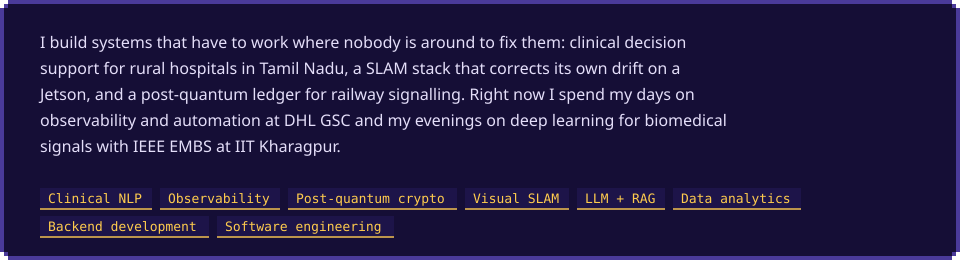</p>

<p align="center"></p>
<p align="center">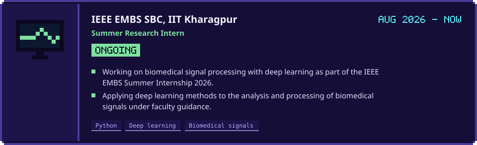</p>
<p align="center">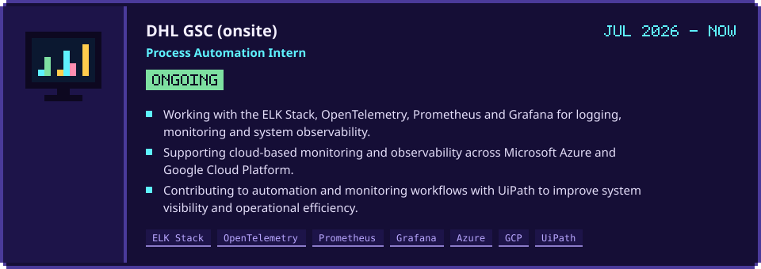</p>
<p align="center">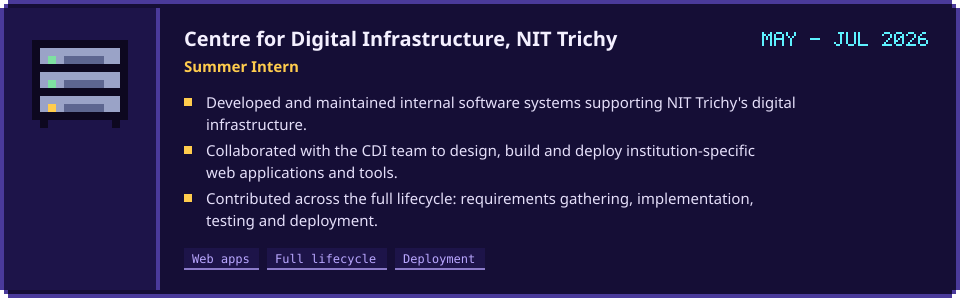</p>
<p align="center">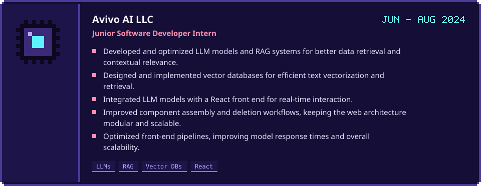</p>
<p align="center">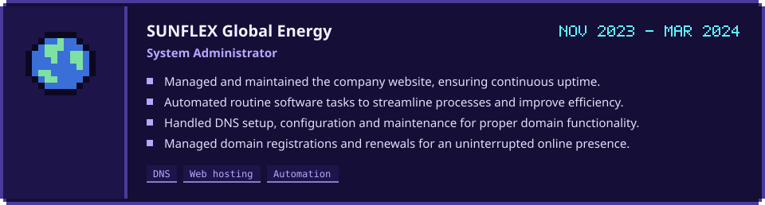</p>
<p align="center">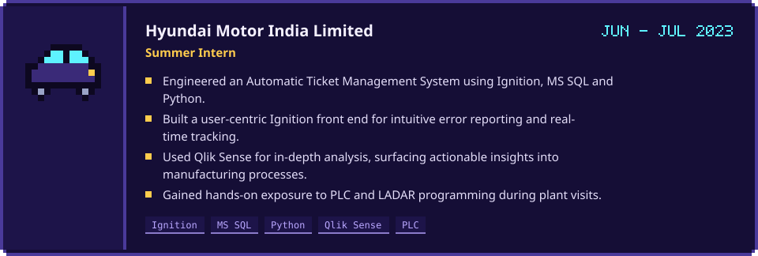</p>

<p align="center"></p>
<p align="center">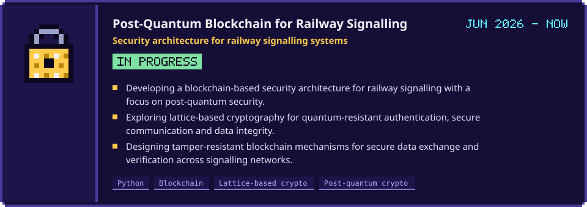</p>
<p align="center">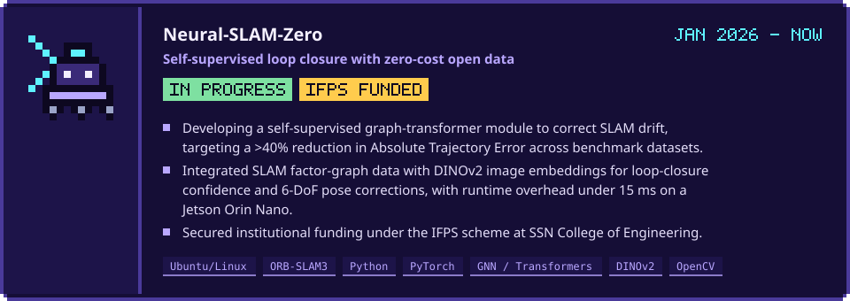</p>
<p align="center"><a href="https://doi.org/10.1109/ISCS69371.2025.11385867">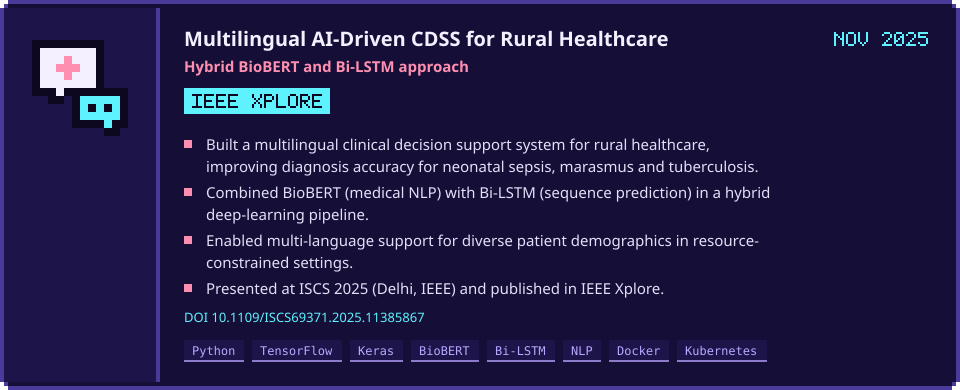</a></p>
<p align="center">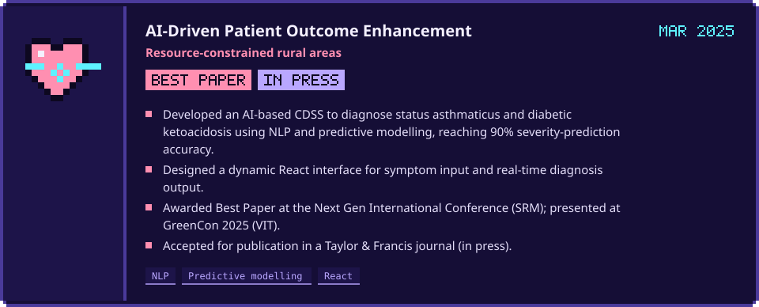</p>
<p align="center"><a href="https://doi.org/10.1109/ACROSET62108.2024.10743609">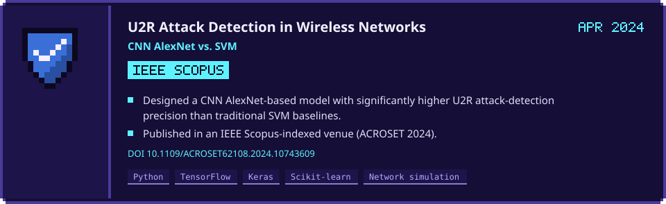</a></p>

<p align="center"></p>

| | Paper | Published in | Link |
|:-:|:--|:--|:-:|
| **1** | **An AI-Driven Approach for Enhancing Patient Healthcare in Resource-Constrained Rural Areas**<br/><sub>Harshavarthan S., Ahmed Hafeel, Sabareeswaran, Kavitha T.</sub> | CRC Press (Taylor & Francis) · *Role of Machine Learning in IoT-Cloud Enabled Healthcare*, Chapter 12, pp. 222–241 | [DOI](https://doi.org/10.1201/9781003777458-12) |
| **2** | **A Multilingual AI-Driven Clinical Decision Support System for Rural Healthcare: Hybrid BioBERT and Bi-LSTM Approach**<br/><sub>Harshavarthan S. et al.</sub> | IEEE Xplore · ISCS 2025, Delhi | [DOI](https://doi.org/10.1109/ISCS69371.2025.11385867) |
| **3** | **NewsImages: CLIP–FAISS Retrieval and Diffusion-Based Generation for Editorial News Thumbnails**<br/><sub>Harshavarthan Saminathan et al.</sub> | CEUR Workshop Proceedings · MediaEval 2025 | [PDF](https://2025.multimediaeval.com/paper46.pdf) |
| **4** | **Effective Forecasting for Enhancing the Precision in U2R Attacks in Wireless Networks through the Use of New CNN AlexNet Compared to SVM Algorithm**<br/><sub>Harshavarthan S. et al.</sub> | IEEE, Scopus-indexed · ACROSET 2024 | [DOI](https://doi.org/10.1109/ACROSET62108.2024.10743609) |
| **5** | **AI-Driven Patient Outcome Enhancement in Resource-Constrained Rural Areas**<br/><sub>Best Paper, Next Gen International Conference (SRM)</sub> | Taylor & Francis journal | *in press* |

<details>
<summary><b>BibTeX — CRC Press chapter</b></summary>

```bibtex
@incollection{harshavarthan2027rural,
  author    = {Harshavarthan, S. and Hafeel, Ahmed and {Sabareeswaran} and Kavitha, T.},
  title     = {An AI-Driven Approach for Enhancing Patient Healthcare in Resource-Constrained Rural Areas},
  booktitle = {Role of Machine Learning in IoT-Cloud Enabled Healthcare: Prospects, Challenges and Opportunities},
  editor    = {Tyagi, Amit Kumar},
  publisher = {CRC Press},
  chapter   = {12},
  pages     = {222--241},
  year      = {2027},
  doi       = {10.1201/9781003777458-12}
}
```

</details>

<p align="center"></p>
<p align="center">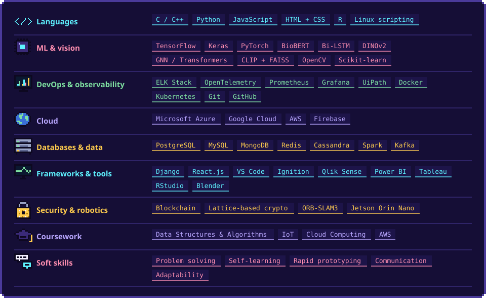</p>

<p align="center"></p>
<p align="center">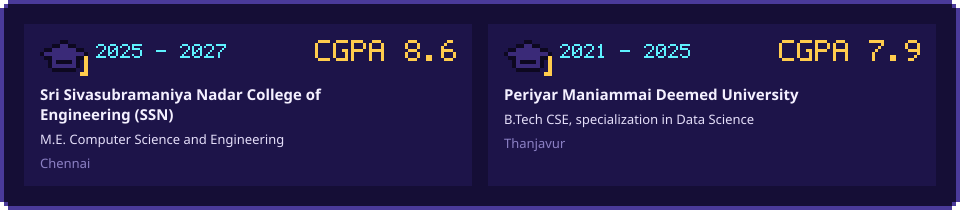</p>

<p align="center"></p>
<p align="center">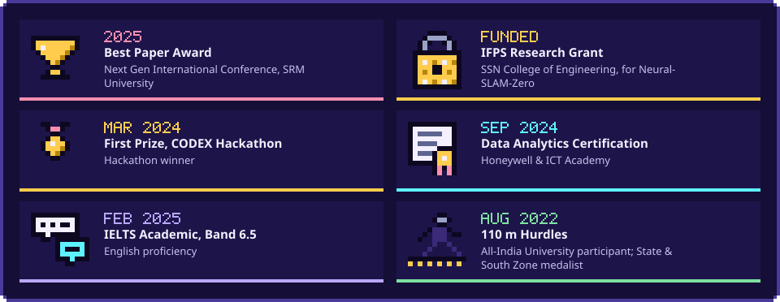</p>

<p align="center"></p>
<p align="center"><a href="mailto:harshavarthansami@gmail.com"></a></p>

<p align="center">
  <a href="mailto:harshavarthansami@gmail.com"><b>Email</b></a> &nbsp;·&nbsp;
  <a href="https://in.linkedin.com/in/harshavarthan-s"><b>LinkedIn</b></a> &nbsp;·&nbsp;
  <a href="https://github.com/harshav111"><b>GitHub</b></a>
  <!-- add ORCID: &nbsp;·&nbsp; <a href="https://orcid.org/YOUR-ORCID"><b>ORCID</b></a> -->
</p>
