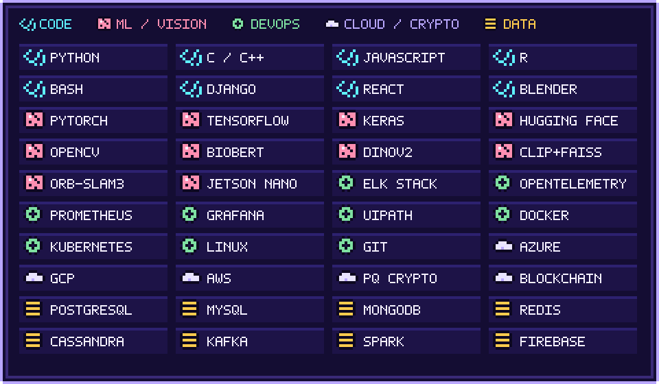

<p align="center">
  
</p>

<p align="center"></p>
<p align="center"></p>

<p align="center"></p>

```text
╔═ QUEST LOG ════════════════════════════════════════════════════
║
║  [!] IEEE EMBS Summer Research, IIT Kharagpur      Aug 2026 - now
║      deep learning for biomedical signal processing
║
║  [!] Process Automation, DHL GSC (onsite)          Jul 2026 - now
║      ELK, OpenTelemetry, Prometheus, Grafana, Azure, GCP, UiPath
║
║  [!] Post-Quantum Blockchain for Railway Signals   Jun 2026 - now
║      lattice-based auth, tamper-resistant ledger
║
║  [!] Neural-SLAM-Zero (IFPS grant, SSN)            Jan 2026 - now
║      graph-transformer loop closure, <15 ms on Jetson Orin Nano
║
║  [!] M.E. Computer Science, SSN                    2025 - 2027
║      CGPA 8.6
║
╚════════════════════════════════════════════════════════════════
```

<p align="center"></p>
<p align="center"></p>

<details>
<summary><b>▶ Cleared stages</b></summary>
<br/>

| Stage | When | Loot |
|:--|:--|:--|
| **NIT Trichy**, Centre for Digital Infrastructure | May – Jul 2026 | Built and deployed institution-specific web apps, end to end |
| **Avivo AI LLC**, junior software developer | Jun – Aug 2024 | LLM + RAG pipelines, vector databases, React front ends for real-time AI |
| **SUNFLEX Global Energy**, system administrator | Nov 2023 – Mar 2024 | Uptime, DNS, domains, automation |
| **Hyundai Motor India**, summer intern | Jun – Jul 2023 | Automatic ticket management (Ignition, MS SQL, Python), Qlik Sense analytics |
| **B.Tech CSE (Data Science)**, Periyar Maniammai Deemed University | 2021 – 2025 | CGPA 7.9 |

</details>

<p align="center"></p>

| Chapter | What happens |
|:--|:--|
| **⛓ Genesis Block** · post-quantum blockchain for railway signalling | Lattice-based cryptography for quantum-resistant authentication and integrity across signalling networks. *Ongoing.* |
| **🛰 Loop Closure** · Neural-SLAM-Zero | Self-supervised graph transformer fuses SLAM factor graphs with DINOv2 embeddings for 6-DoF pose correction, under 15 ms on a Jetson Orin Nano. *Funded by IFPS, SSN.* |
| **🩺 Polyglot Diagnosis** · multilingual CDSS | Hybrid BioBERT + Bi-LSTM for neonatal sepsis, marasmus and tuberculosis in rural healthcare. *Published, IEEE Xplore.* |
| **🫁 Second Opinion** · patient outcome enhancement | Severity prediction for status asthmaticus and diabetic ketoacidosis, 90% accuracy, React front end. *Best Paper at SRM, presented at GreenCon 2025 (VIT).* |

<p align="center"></p>

| # | Spell | Grimoire | Cast |
|:--|:--|:--|:--|
| ✦ | An AI-Driven Approach for Enhancing Patient Healthcare in Resource-Constrained Rural Areas | CRC Press (Taylor & Francis), book chapter 12, pp. 222–241 | [doi](https://doi.org/10.1201/9781003777458-12) |
| ✦ | A Multilingual AI-Driven Clinical Decision Support System for Rural Healthcare: Hybrid BioBERT and Bi-LSTM Approach | IEEE Xplore (ISCS 2025) | [doi](https://doi.org/10.1109/ISCS69371.2025.11385867) |
| ✦ | NewsImages: CLIP–FAISS Retrieval and Diffusion-Based Generation for Editorial News Thumbnails | CEUR Workshop Proceedings (MediaEval 2025) | [pdf](https://2025.multimediaeval.com/paper46.pdf) |
| ✦ | Effective Forecasting for Enhancing the Precision in U2R Attacks in Wireless Networks through the Use of New CNN AlexNet Compared to SVM Algorithm | IEEE, Scopus-indexed (ACROSET 2024) | [doi](https://doi.org/10.1109/ACROSET62108.2024.10743609) |
| ✧ | AI-Driven Patient Outcome Enhancement in Resource-Constrained Rural Areas | Taylor & Francis journal | *charging (in press)* |

<details>
<summary><b>▶ BibTeX scroll</b></summary>

```bibtex
@incollection{harshavarthan2027rural,
  author    = {Harshavarthan, S. and Hafeel, Ahmed and {Sabareeswaran} and Kavitha, T.},
  title     = {An AI-Driven Approach for Enhancing Patient Healthcare in Resource-Constrained Rural Areas},
  booktitle = {Role of Machine Learning in IoT-Cloud Enabled Healthcare: Prospects, Challenges and Opportunities},
  editor    = {Tyagi, Amit Kumar},
  publisher = {CRC Press},
  chapter   = {12},
  pages     = {222--241},
  year      = {2027},
  doi       = {10.1201/9781003777458-12}
}
```

</details>

<p align="center"></p>
<p align="center"></p>

<p align="center"></p>
<p align="center"></p>

<p align="center"></p>
<p align="center">
  <a href="mailto:harshavarthansami@gmail.com"></a>
</p>

<p align="center">
  <b><a href="https://in.linkedin.com/in/harshavarthan-s">▶ LinkedIn</a></b> &nbsp;&nbsp;
  <b><a href="mailto:harshavarthansami@gmail.com">▶ Email</a></b>
</p>
