<table align="center">
<tr>
<td width="300" align="center">

</td>
<td valign="middle">

```console
harsha@genesis:~$ whoami
Harshavarthan S
DevOps × ML researcher · M.E. CSE @ SSN, Chennai

harsha@genesis:~$ cat motto.txt
"Ship it, watch it, prove it."
```

<a href="https://git.io/typing-svg"></a>

<a href="https://in.linkedin.com/in/harshavarthan-s"></a>
<a href="mailto:harshavarthansami@gmail.com"></a>
<!-- Add your ORCID iD (0000-0000-0000-0000) and uncomment:
<a href="https://orcid.org/YOUR-ORCID"></a>
-->

</td>
</tr>
</table>

<p align="center">
  
</p>

## `$ kubectl get pods -n harsha`

```console
NAME                          READY   STATUS      AGE   NOTES
ieee-embs-iit-kharagpur       1/1     Running     2mo   deep learning for biomedical signal processing
dhl-gsc-process-automation    1/1     Running     3mo   ELK · OpenTelemetry · Prometheus · Grafana · UiPath
pq-blockchain-railway         1/1     Running     4mo   lattice-based auth for railway signalling
neural-slam-zero              1/1     Running     9mo   IFPS-funded · Jetson Orin Nano · <15 ms
me-cse-ssn                    1/1     Running     1y    CGPA 8.6
nit-trichy-cdi                0/1     Completed   -     May – Jul 2026 · institute web apps
```

## 🚀 Career pipeline

<p align="center">
  
</p>

<details>
<summary><b>Job logs</b> &nbsp;<sub>(click to expand)</sub></summary>
<br/>

| Stage | When | What shipped |
|:--|:--|:--|
| **IEEE EMBS Summer Research Intern**, IIT Kharagpur | Aug 2026 – now | Deep learning for analysis and processing of biomedical signals (IEEE EMBS Summer Internship 2026) |
| **Process Automation Intern**, DHL GSC (onsite) | Jul 2026 – now | Logging, monitoring and observability with ELK, OpenTelemetry, Prometheus and Grafana across Azure and GCP; UiPath automation workflows |
| **Summer Intern**, Centre for Digital Infrastructure, NIT Trichy | May – Jul 2026 | Designed, built and deployed institution-specific web apps across the full lifecycle |
| **Junior Software Developer Intern**, Avivo AI LLC | Jun – Aug 2024 | LLM + RAG pipelines, vector databases for retrieval, React front ends for real-time interaction |
| **System Administrator**, SUNFLEX Global Energy | Nov 2023 – Mar 2024 | Website uptime, DNS, domain management, task automation |
| **Summer Intern**, Hyundai Motor India | Jun – Jul 2023 | Automatic ticket management (Ignition, MS SQL, Python), Qlik Sense manufacturing analytics |

<sub>**Education:** M.E. CSE, SSN College of Engineering (2025–27, CGPA 8.6) · B.Tech CSE (Data Science), Periyar Maniammai Deemed University (2021–25, CGPA 7.9)</sub>

</details>

## 📦 Deployments

<table>
<tr>
<td width="50%" valign="top">

### ⛓️ Post-quantum blockchain for railway signalling
<sub>`Jun 2026 – now`</sub>

Tamper-resistant ledger for data exchange across railway signalling networks, with lattice-based cryptography for quantum-resistant authentication and integrity.

```yaml
image: python · blockchain · lattice-crypto · PQC
status: building
```

</td>
<td width="50%" valign="top">

### 🛰️ Neural-SLAM-Zero
<sub>`Jan 2026 – now` · IFPS grant, SSN</sub>

Self-supervised graph-transformer loop closure that corrects SLAM drift, fusing factor-graph data with DINOv2 embeddings for 6-DoF pose corrections.

```yaml
target:  ">40% lower ATE across benchmarks"
runtime: "<15 ms on Jetson Orin Nano"
image:   ORB-SLAM3 · PyTorch · GNN · DINOv2 · OpenCV
```

</td>
</tr>
<tr>
<td width="50%" valign="top">

### 🏥 Multilingual clinical decision support
<sub>`Nov 2025` · IEEE ISCS 2025</sub>

Hybrid BioBERT + Bi-LSTM pipeline for neonatal sepsis, marasmus and tuberculosis, built for multilingual rural healthcare.

```yaml
image: TensorFlow · Keras · BioBERT · Docker · Kubernetes
status: published (IEEE Xplore)
```

</td>
<td width="50%" valign="top">

### 🫁 Patient outcome enhancement
<sub>`Mar 2025` · 🏆 Best Paper, SRM</sub>

NLP and predictive modelling for status asthmaticus and diabetic ketoacidosis with a React front end for real-time diagnosis. Also presented at GreenCon 2025 (VIT).

```yaml
accuracy: "90% severity prediction"
status:   in press (Taylor & Francis)
```

</td>
</tr>
</table>

## 📜 `$ git log --oneline papers/`

| ref | Paper | Venue | Link |
|:--|:--|:--|:--|
| `HEAD` | An AI-Driven Approach for Enhancing Patient Healthcare in Resource-Constrained Rural Areas | CRC Press (Taylor & Francis), book chapter 12, pp. 222–241 | [](https://www.taylorfrancis.com/chapters/edit/10.1201/9781003777458-12/ai-driven-approach-enhancing-patient-healthcare-resource-constrained-rural-areas-harshavarthan-ahmed-hafeel-sabareeswaran-kavitha) |
| `HEAD~1` | A Multilingual AI-Driven Clinical Decision Support System for Rural Healthcare: Hybrid BioBERT and Bi-LSTM Approach | IEEE Xplore (ISCS 2025) | [](https://doi.org/10.1109/ISCS69371.2025.11385867) |
| `HEAD~2` | NewsImages: CLIP–FAISS Retrieval and Diffusion-Based Generation for Editorial News Thumbnails | CEUR Workshop Proceedings (MediaEval 2025) | [](https://2025.multimediaeval.com/paper46.pdf) |
| `HEAD~3` | Effective Forecasting for Enhancing the Precision in U2R Attacks in Wireless Networks through the Use of New CNN AlexNet Compared to SVM Algorithm | IEEE, Scopus-indexed (ACROSET 2024) | [](https://doi.org/10.1109/ACROSET62108.2024.10743609) |
| `stash` | AI-Driven Patient Outcome Enhancement in Resource-Constrained Rural Areas | Taylor & Francis journal, in press · 🏆 Best Paper |  |

<details>
<summary><sub><b>BibTeX for the CRC Press chapter</b></sub></summary>

```bibtex
@incollection{harshavarthan2027rural,
  author    = {Harshavarthan, S. and Hafeel, Ahmed and {Sabareeswaran} and Kavitha, T.},
  title     = {An AI-Driven Approach for Enhancing Patient Healthcare in Resource-Constrained Rural Areas},
  booktitle = {Role of Machine Learning in IoT-Cloud Enabled Healthcare: Prospects, Challenges and Opportunities},
  editor    = {Tyagi, Amit Kumar},
  publisher = {CRC Press},
  chapter   = {12},
  pages     = {222--241},
  year      = {2027},
  doi       = {10.1201/9781003777458-12}
}
```

</details>

## 🧰 `docker compose ps`

| Layer | Services |
|:--|:--|
| **observe** |  &nbsp;   |
| **cloud** |  |
| **learn** |  &nbsp;      |
| **build** |  |
| **store** |  &nbsp;  |

## 📈 Telemetry

<p align="center">
<picture>
  <source media="(prefers-color-scheme: dark)" srcset="https://streak-stats.demolab.com?user=harshav111&hide_border=true&background=120C30&ring=FFCC4D&fire=FF8FB1&currStreakLabel=FFCC4D&sideLabels=E9E4FF&sideNums=FFFFFF&currStreakNum=FFFFFF&dates=9A90C9&stroke=3A2A78"/>
  
</picture>
</p>

<p align="center">
<picture>
  <source media="(prefers-color-scheme: dark)" srcset="https://github-readme-activity-graph.vercel.app/graph?username=harshav111&bg_color=120c30&color=e9e4ff&line=ffcc4d&point=ff8fb1&area=true&area_color=3a2a78&hide_border=true"/>
  
</picture>
</p>

<details>
<summary><b>🌸 Side quests</b></summary>
<br/>

- 🏃 110 m hurdles · All-India University participant, State and South Zone medalist (2022)
- 🥇 First prize, CODEX Hackathon (2024)
- 📊 Data Analytics certification, Honeywell & ICT Academy (2024)

</details>

<br/>

```console
harsha@genesis:~$ ./contact --linkedin in.linkedin.com/in/harshavarthan-s --mail harshavarthansami@gmail.com
connection established. exit 0
```
